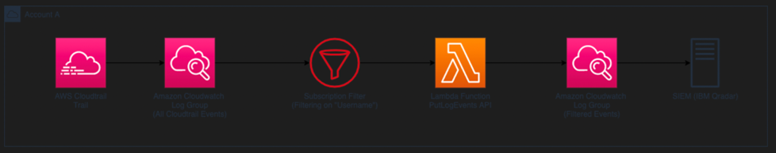

# Single Account Filtering
#### Using terraform to set up:


#### Before running terraform apply
Add your own access key and secret
```
variable "access_key" {
  description = "AWS access key"
  default = {value}
}

variable "secret_key" {
  description = "AWS secret key"
  default = {value}
}
```
